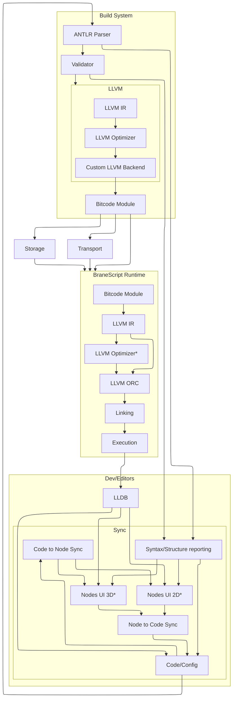

# Toolchain

```mermaid
%%{init: {"flowchart": {"defaultRenderer": "elk"}} }%%
flowchart TD
    subgraph Editor[Dev/Editors]
    subgraph Sync 
        NodeToCode[Node to Code Sync]
        CodeToNode[Code to Node Sync]
        Error[Syntax/Structure reporting]

        Error --> Code
        Error --> Nodes2D
        Error --> Nodes3D

    end
    LLDB --> Code
    LLDB --> Nodes2D   
    LLDB --> Nodes3D
    NodeToCode --> Code[Code/Config]
    Nodes2D[Nodes UI 2D*]
    Nodes3D[Nodes UI 3D*]
    Code --> CodeToNode
    CodeToNode --> Nodes2D
    Nodes2D --> NodeToCode
    CodeToNode --> Nodes3D
    Nodes3D --> NodeToCode

    end
    Code --> ANTLR[ANTLR Parser]
    subgraph Build System
    ANTLR --> Error
    ANTLR --> Validator[Validator]
    Validator --> Error
    Validator --> LLVM

    subgraph LLVM
    
    IR[LLVM IR]  --> Optimizer[LLVM Optimizer]
    Optimizer --> Conv[Custom LLVM Backend]
    end

    Conv --> Bitcode[Bitcode Module]

    end

    Bitcode --> Storage[Storage] 
    Storage --> Runtime

    Bitcode --> Transport
    Transport --> Runtime

    Bitcode --> Runtime

    subgraph Runtime [BraneScript Runtime]
        Bitcode2[Bitcode Module] --> IR2[LLVM IR]
        IR2 --> Optimizer2[LLVM Optimizer*]
        IR2 --> JIT[LLVM ORC]
        Optimizer2 --> JIT
        JIT --> Linking
        Linking --> Execution[Execution]
        Execution --> LLDB
    end

```
\* Optional

